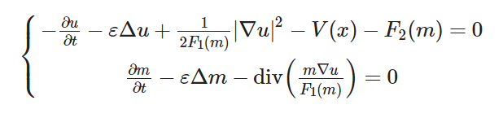

The Policy Algorithm of solving mean field game and mean field type control problem with finite difference method.



Check the examples in [colab](https://colab.research.google.com/drive/19FLjyv5alw3dq1QeK9zovuAMfIM3LKPE?usp=sharing).

There are some code could be optimized to get more efficiency. Now only support periodic boundary condition and 1d/2d problem.

There are a lot of repeated code which I will refactor, but the main code about policy iteration is short like this:
```julia
# println("start Policy Iteration")
for iter in 1:maxit
    solve_FP!(M, Q)
    update_control!(Q_tilde, U, M, D, update_Q)
    solve_HJB!(U, M, Q_tilde)
    update_control!(Q_new, U, M, D, update_Q)

    resFP, resHJB = compute_res(U, M, Q_new)
    Q, Q_new = Q_new, Q

    ### other logging code
end
```

`solve_FP!(M,Q)` solves the FP equation and changes the values in M, when building the lhs matrix, use the tranpose of HJB equation's lhs:
```julia
function solve_FP_helper!(M, Q)
    """
    solve FP equation with control.
    sum(map((q,d)->spdiagm(q[:,ti-1])*d, values(Q), values(D))) is just like
    spdiagm(Q.QL[:,ti-1])*D.DL + spdiagm(Q.QR[:,ti-1])*D.DR
    when solve M_n, use the information Q_{n-1} = U_{n-1}/F1(M_n)
    """
    for ti in 2:N+1
        lhs = I - ht .* (ε .* A - sum(map((q,d)->spdiagm(q[:,ti-1])*d, values(Q), values(D))))
        M[:,ti] = lhs' \ M[:,ti-1]
    end
    return nothing
end
```

`solve_HJB!(U,M,Q)` solves the HJB equation and changes the values in U:
```julia
function solve_HJB_helper!(U,M,Q)
    """
    solve HJB equation with Q and M
    when solve U_n, use the information Q_n and M_{n+1}
    """
    for ti in N:-1:1  
        lhs = I - ht .* (ε .* A - sum(map((q,d)->spdiagm(q[:,ti])*d, values(Q), values(D))))
        rhs = U[:,ti+1] + ht .*  (0.5 .*  F1.(M[:,ti+1]) .*sum(map(q->q[:,ti].^2, Q)) + V + F2.(M[:,ti+1]))
        U[:,ti] = lhs \ rhs
    end
    return nothing
end
```

`update_control!(Q_new,U,M)` updates Q with U and M and stores it in `Q_new`:
```julia
# Dimension 2
function update_control!(Q_new, U, M)
    """
    update Q_n = Du_n/F1(M_{n+1})
    so the Hamiltonian always use M_{n+1} term.
    """
    Q_new.QL1 .= update_Q.(max.(D.DL1*U[:,1:end-1],0) , M[:,2:end])
    Q_new.QR1 .= update_Q.(min.(D.DR1*U[:,1:end-1],0) , M[:,2:end])
    Q_new.QL2 .= update_Q.(max.(D.DL2*U[:,1:end-1],0) , M[:,2:end])
    Q_new.QR2 .= update_Q.(min.(D.DR2*U[:,1:end-1],0) , M[:,2:end])
    return nothing
end
```

for fixed point iteration, the difference is at funtion of solve HJB:
```julia
function solve_HJB_fixpoint_helper!(U_new, U_old, Q, M)
    """
    Q = DU_old / F1(M) 
    U_new = U_old + jacon^{-1} * (-res)   # loop with t
    """
    # update U with U_old and M
    for ti in N:-1:1
        U_temp = copy(U_old[:,ti])
        update_control!(Q, U_temp, M, D, update_Q, ti)
        for inner_it in 1:300
            jacon = 1/ht*I -  ε .* A + 1 .*
                (spdiagm(Q.QL1[:,ti])*D.DL1 + spdiagm(Q.QR1[:,ti])*D.DR1 +
                spdiagm(Q.QL2[:,ti])*D.DL2 + spdiagm(Q.QR2[:,ti])*D.DR2)

            res = -(U_new[:,ti+1]-U_temp) ./ ht - ε .* A*U_temp + 
                    0.5 .* F1.(M[:,ti+1]) .* (Q.QL1[:,ti].^2 + Q.QR1[:,ti].^2 + Q.QL2[:,ti].^2 + Q.QR2[:,ti].^2) -
                    V - F2.(M[:,ti+1])
            
            # if residual is small enough, set U_new[:,ti], then go to solve U at ti-1
            if sqrt(hs1*hs2)*norm(res) < 1e-12
                U_new[:,ti] = U_temp
                break

            # if inner loop reach the max iteration, give some warning
            elseif inner_it==300
                println("inner HJB solver not converge")

            # if residual is not small enough, update U at ti
            else
                U_temp = jacon \ (-res) + U_temp
                update_control!(Q, U_temp, M, D, update_Q, ti)
            end
        end
    end
    return nothing
end
```

for `H(m,Du) = |Du|^3/(3m^{1/2})` case, there are difference at `solve_HJB!` and `update_control`:
```julia
function solve_HJB_helper_non_quad!(U, M, Q)
    """
    solve HJB equation with Q and M,
    the L(q,Du,m) = qDU - 2/3 * (m^{1/4}) * (q1^2+ q2^2+ q3^2+ q4^2)^{3/4}
    """
    for ti in N:-1:1  
        lhs = I - ht .* (ε .* A - sum(map((q,d)->spdiagm(q[:,ti])*d, values(Q), values(D))))
        rhs = U[:,ti+1] + ht .*  ((2/3) .*F1.(M[:,ti+1]) .*sum(map(q->q[:,ti].^2, Q)).^0.75 + V + F2.(M[:,ti+1]))
        U[:,ti] = lhs \ rhs
    end
    return nothing
end

function update_control_non_quad!(Q_new, U, M)
    size_Q_s, size_Q_t = size(Q_new.QL1)
    """
    update control Q from U and M
    Q_n = |Du_n|/m_{n+1}^{1/2} * Du_n
    """
    for ti in 1:size_Q_t
        DLu1 = max.(D.DL1*U[:,ti],0)
        DRu1 = min.(D.DR1*U[:,ti],0)
        DLu2 = max.(D.DL2*U[:,ti],0)
        DRu2 = min.(D.DR2*U[:,ti],0)
        Du_norm = sqrt.(abs2.(DLu1)+abs2.(DRu1)+abs2.(DLu2)+abs2.(DRu2))
            
        Q_new.QL1[:,ti] = update_Q.(DLu1, Du_norm, M[:,ti+1]) 
        Q_new.QR1[:,ti] = update_Q.(DRu1, Du_norm, M[:,ti+1]) 
        Q_new.QL2[:,ti] = update_Q.(DLu2, Du_norm, M[:,ti+1]) 
        Q_new.QR2[:,ti] = update_Q.(DRu2, Du_norm, M[:,ti+1]) 
    end
    return nothing
end
```


