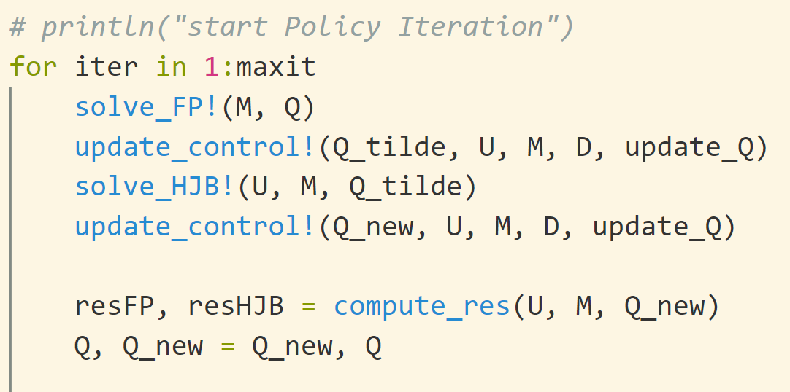

The Policy Algorithm of solving mean field game and mean field type control problem with finite difference method. 

Check the examples in [colab](https://colab.research.google.com/drive/19FLjyv5alw3dq1QeK9zovuAMfIM3LKPE?usp=sharing).

There are some code could be optimized to get more efficiency.

Now only support periodic boundary contion and 1d/2d problem.

the main code about policy iteration is as:

the help function could be found in `src/utils.jl`
